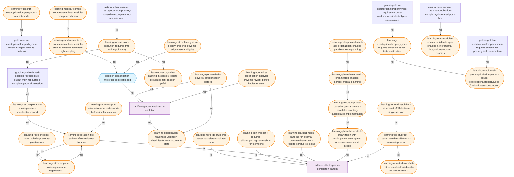

```mermaid
flowchart TB
  learning-retro-agent-first-sdd-workflow-reduces-iteration(["learning-retro-agent-first-sdd-workflow-reduces-iteration"])
  learning-retro-template-review-prevents-regeneration(["learning-retro-template-review-prevents-regeneration"])
  learning-retro-exploration-phase-prevents-specification-rework(["learning-retro-exploration-phase-prevents-specification-rework"])
  learning-retro-analysis-driven-fixes-prevent-rework-before-implementation(["learning-retro-analysis-driven-fixes-prevent-rework-before-implementation"])
  learning-retro-checklist-format-clarity-prevents-gate-blockers(["learning-retro-checklist-format-clarity-prevents-gate-blockers"])
  gotcha-gotcha-forked-session-retrospective-output-may-not-surface-completely-to-main-session["gotcha-gotcha-forked-session-retrospective-output-may-not-surface-completely-to-main-session"]
  learning-spec-analysis-severity-categorisation-pattern(["learning-spec-analysis-severity-categorisation-pattern"])
  learning-specification-readiness-validation-checklist-format-vs-content-state(["learning-specification-readiness-validation-checklist-format-vs-content-state"])
  artifact-spec-analysis-issue-resolution["artifact-spec-analysis-issue-resolution"]
  learning-retro-tdd-stub-first-pattern-accelerates-phase-startup(["learning-retro-tdd-stub-first-pattern-accelerates-phase-startup"])
  learning-retro-gotcha-caching-in-session-restore-prevented-fork-session-pitfall(["learning-retro-gotcha-caching-in-session-restore-prevented-fork-session-pitfall"])
  learning-typescript-exactoptionalpropertytypes-in-strict-mode(["learning-typescript-exactoptionalpropertytypes-in-strict-mode"])
  gotcha-retro-exactoptionalpropertytypes-friction-in-object-building-patterns["gotcha-retro-exactoptionalpropertytypes-friction-in-object-building-patterns"]
  learning-bun-typescript-requires-allowimportingtsextensions-for-ts-imports(["learning-bun-typescript-requires-allowimportingtsextensions-for-ts-imports"])
  decision-classification-three-tier-cost-optimised{{"decision-classification-three-tier-cost-optimised"}}
  artifact-sdd-tdd-phase-completion-pattern["artifact-sdd-tdd-phase-completion-pattern"]
  learning-fork-session-execution-requires-tmp-working-directory(["learning-fork-session-execution-requires-tmp-working-directory"])
  learning-retro-tdd-stub-first-pattern-with-211-tests-in-single-session(["learning-retro-tdd-stub-first-pattern-with-211-tests-in-single-session"])
  learning-retro-phase-based-task-organization-enables-parallel-mental-planning(["learning-retro-phase-based-task-organization-enables-parallel-mental-planning"])
  gotcha-gotcha-exactoptionalpropertytypes-requires-verbose-workarounds-in-test-object-construction["gotcha-gotcha-exactoptionalpropertytypes-requires-verbose-workarounds-in-test-object-construction"]
  learning-retro-clear-bypass-priority-ordering-prevents-edge-case-ambiguity(["learning-retro-clear-bypass-priority-ordering-prevents-edge-case-ambiguity"])
  learning-retro-tdd-phase-based-organization-with-parallel-test-writing-accelerates-implementation(["learning-retro-tdd-phase-based-organization-with-parallel-test-writing-accelerates-implementation"])
  learning-tdd-stub-first-pattern-enables-290-tests-across-6-phases(["learning-tdd-stub-first-pattern-enables-290-tests-across-6-phases"])
  gotcha-gotcha-exactoptionalpropertytypes-requires-conditional-property-inclusion-pattern["gotcha-gotcha-exactoptionalpropertytypes-requires-conditional-property-inclusion-pattern"]
  learning-learning-mock-patterns-for-external-command-execution-require-careful-test-setup(["learning-learning-mock-patterns-for-external-command-execution-require-careful-test-setup"])
  learning-phase-based-task-organization-enables-parallel-mental-planning(["learning-phase-based-task-organization-enables-parallel-mental-planning"])
  learning-modular-context-sources-enable-extensible-prompt-enrichment(["learning-modular-context-sources-enable-extensible-prompt-enrichment"])
  learning-exactoptionalpropertytypes-requires-omission-based-test-construction(["learning-exactoptionalpropertytypes-requires-omission-based-test-construction"])
  learning-retro-tdd-stub-first-pattern-scales-to-404-tests-with-zero-rework(["learning-retro-tdd-stub-first-pattern-scales-to-404-tests-with-zero-rework"])
  learning-phase-based-task-organization-with-testimplementation-pairs-enables-clear-mental-models(["learning-phase-based-task-organization-with-testimplementation-pairs-enables-clear-mental-models"])
  learning-retro-modular-context-builder-design-enabled-6-incremental-integrations-without-conflicts(["learning-retro-modular-context-builder-design-enabled-6-incremental-integrations-without-conflicts"])
  gotcha-retro-memory-graph-deduplication-complexity-increased-post-hoc["gotcha-retro-memory-graph-deduplication-complexity-increased-post-hoc"]
  learning-modular-context-sources-enable-extensible-prompt-enrichment-without-tight-coupling(["learning-modular-context-sources-enable-extensible-prompt-enrichment-without-tight-coupling"])
  learning-agent-first-specification-analysis-prevents-rework-before-implementation(["learning-agent-first-specification-analysis-prevents-rework-before-implementation"])
  learning-conditional-property-inclusion-pattern-solves-exactoptionalpropertytypes-friction-in-test-construction(["learning-conditional-property-inclusion-pattern-solves-exactoptionalpropertytypes-friction-in-test-construction"])
  gotcha-forked-session-retrospective-output-may-not-surface-completely-to-main-session["gotcha-forked-session-retrospective-output-may-not-surface-completely-to-main-session"]
  learning-retro-exploration-phase-prevents-specification-rework -->|rel| learning-retro-agent-first-sdd-workflow-reduces-iteration
  learning-retro-agent-first-sdd-workflow-reduces-iteration -->|rel| learning-retro-template-review-prevents-regeneration
  learning-retro-template-review-prevents-regeneration -->|rel| learning-retro-agent-first-sdd-workflow-reduces-iteration
  learning-retro-analysis-driven-fixes-prevent-rework-before-implementation -->|rel| learning-retro-agent-first-sdd-workflow-reduces-iteration
  learning-retro-checklist-format-clarity-prevents-gate-blockers -->|rel| learning-retro-template-review-prevents-regeneration
  gotcha-gotcha-forked-session-retrospective-output-may-not-surface-completely-to-main-session -->|rel| learning-retro-exploration-phase-prevents-specification-rework
  learning-spec-analysis-severity-categorisation-pattern -->|rel| artifact-spec-analysis-issue-resolution
  artifact-spec-analysis-issue-resolution -->|rel| learning-specification-readiness-validation-checklist-format-vs-content-state
  learning-spec-analysis-severity-categorisation-pattern -->|rel| learning-specification-readiness-validation-checklist-format-vs-content-state
  learning-fork-session-execution-requires-tmp-working-directory -->|rel| gotcha-gotcha-forked-session-retrospective-output-may-not-surface-completely-to-main-session
  learning-fork-session-execution-requires-tmp-working-directory -->|rel| learning-retro-gotcha-caching-in-session-restore-prevented-fork-session-pitfall
  learning-retro-tdd-stub-first-pattern-accelerates-phase-startup -->|rel| artifact-sdd-tdd-phase-completion-pattern
  learning-typescript-exactoptionalpropertytypes-in-strict-mode -->|rel| gotcha-retro-exactoptionalpropertytypes-friction-in-object-building-patterns
  learning-bun-typescript-requires-allowimportingtsextensions-for-ts-imports -->|rel| artifact-sdd-tdd-phase-completion-pattern
  decision-classification-three-tier-cost-optimised -->|rel| artifact-spec-analysis-issue-resolution
  learning-retro-agent-first-sdd-workflow-reduces-iteration -->|rel| artifact-sdd-tdd-phase-completion-pattern
  learning-retro-tdd-stub-first-pattern-with-211-tests-in-single-session -->|rel| learning-tdd-stub-first-pattern-enables-290-tests-across-6-phases
  learning-tdd-stub-first-pattern-enables-290-tests-across-6-phases -->|rel| learning-retro-tdd-stub-first-pattern-scales-to-404-tests-with-zero-rework
  learning-retro-phase-based-task-organization-enables-parallel-mental-planning -->|rel| learning-phase-based-task-organization-enables-parallel-mental-planning
  learning-exactoptionalpropertytypes-requires-omission-based-test-construction -->|rel| learning-conditional-property-inclusion-pattern-solves-exactoptionalpropertytypes-friction-in-test-construction
  learning-modular-context-sources-enable-extensible-prompt-enrichment -->|rel| learning-modular-context-sources-enable-extensible-prompt-enrichment-without-tight-coupling
  learning-learning-mock-patterns-for-external-command-execution-require-careful-test-setup -->|rel| artifact-sdd-tdd-phase-completion-pattern
  learning-phase-based-task-organization-with-testimplementation-pairs-enables-clear-mental-models -->|rel| artifact-sdd-tdd-phase-completion-pattern
  learning-tdd-stub-first-pattern-enables-290-tests-across-6-phases -->|rel| artifact-sdd-tdd-phase-completion-pattern
  learning-modular-context-sources-enable-extensible-prompt-enrichment-without-tight-coupling -->|rel| decision-classification-three-tier-cost-optimised
  gotcha-gotcha-exactoptionalpropertytypes-requires-conditional-property-inclusion-pattern -->|rel| learning-conditional-property-inclusion-pattern-solves-exactoptionalpropertytypes-friction-in-test-construction
  learning-phase-based-task-organization-enables-parallel-mental-planning -->|rel| learning-retro-tdd-phase-based-organization-with-parallel-test-writing-accelerates-implementation
  learning-retro-tdd-phase-based-organization-with-parallel-test-writing-accelerates-implementation -->|rel| learning-phase-based-task-organization-with-testimplementation-pairs-enables-clear-mental-models
  gotcha-retro-memory-graph-deduplication-complexity-increased-post-hoc -->|rel| learning-retro-modular-context-builder-design-enabled-6-incremental-integrations-without-conflicts
  learning-retro-clear-bypass-priority-ordering-prevents-edge-case-ambiguity -->|rel| decision-classification-three-tier-cost-optimised
  learning-agent-first-specification-analysis-prevents-rework-before-implementation -->|rel| artifact-spec-analysis-issue-resolution
  gotcha-gotcha-exactoptionalpropertytypes-requires-verbose-workarounds-in-test-object-construction -->|rel| learning-exactoptionalpropertytypes-requires-omission-based-test-construction
  gotcha-forked-session-retrospective-output-may-not-surface-completely-to-main-session -->|rel| learning-fork-session-execution-requires-tmp-working-directory

  classDef learning fill:#fff3e0,stroke:#f57c00
  classDef artifact fill:#f3e5f5,stroke:#7b1fa2
  classDef decision fill:#e1f5fe,stroke:#0288d1
  class learning-retro-agent-first-sdd-workflow-reduces-iteration,learning-retro-template-review-prevents-regeneration,learning-retro-exploration-phase-prevents-specification-rework,learning-retro-analysis-driven-fixes-prevent-rework-before-implementation,learning-retro-checklist-format-clarity-prevents-gate-blockers,learning-spec-analysis-severity-categorisation-pattern,learning-specification-readiness-validation-checklist-format-vs-content-state,learning-retro-tdd-stub-first-pattern-accelerates-phase-startup,learning-retro-gotcha-caching-in-session-restore-prevented-fork-session-pitfall,learning-typescript-exactoptionalpropertytypes-in-strict-mode,learning-bun-typescript-requires-allowimportingtsextensions-for-ts-imports,learning-fork-session-execution-requires-tmp-working-directory,learning-retro-tdd-stub-first-pattern-with-211-tests-in-single-session,learning-retro-phase-based-task-organization-enables-parallel-mental-planning,learning-retro-clear-bypass-priority-ordering-prevents-edge-case-ambiguity,learning-retro-tdd-phase-based-organization-with-parallel-test-writing-accelerates-implementation,learning-tdd-stub-first-pattern-enables-290-tests-across-6-phases,learning-learning-mock-patterns-for-external-command-execution-require-careful-test-setup,learning-phase-based-task-organization-enables-parallel-mental-planning,learning-modular-context-sources-enable-extensible-prompt-enrichment,learning-exactoptionalpropertytypes-requires-omission-based-test-construction,learning-retro-tdd-stub-first-pattern-scales-to-404-tests-with-zero-rework,learning-phase-based-task-organization-with-testimplementation-pairs-enables-clear-mental-models,learning-retro-modular-context-builder-design-enabled-6-incremental-integrations-without-conflicts,learning-modular-context-sources-enable-extensible-prompt-enrichment-without-tight-coupling,learning-agent-first-specification-analysis-prevents-rework-before-implementation,learning-conditional-property-inclusion-pattern-solves-exactoptionalpropertytypes-friction-in-test-construction learning
  class artifact-spec-analysis-issue-resolution,artifact-sdd-tdd-phase-completion-pattern artifact
  class decision-classification-three-tier-cost-optimised decision
```
